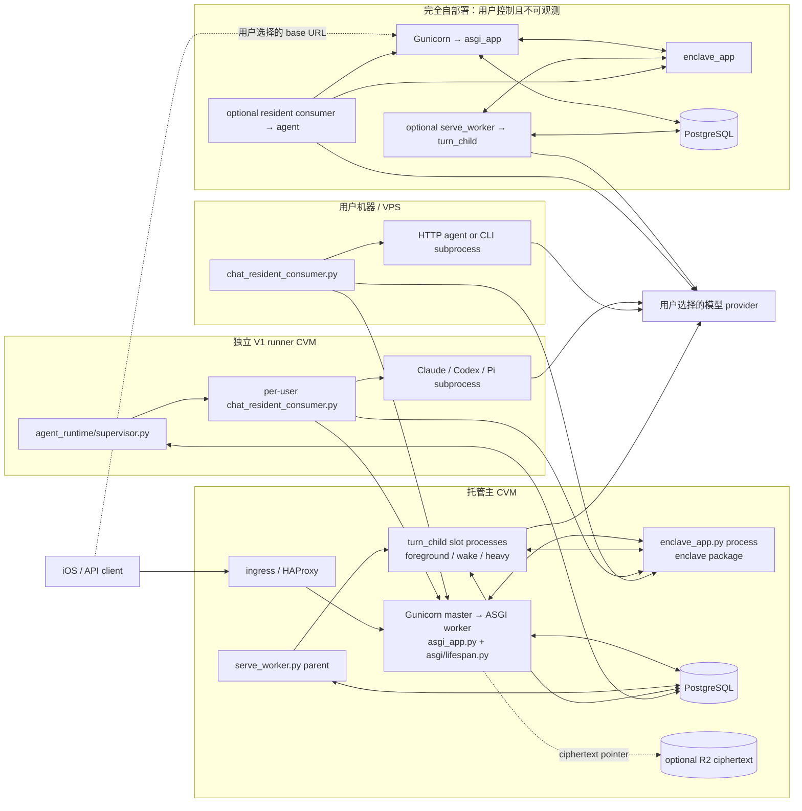
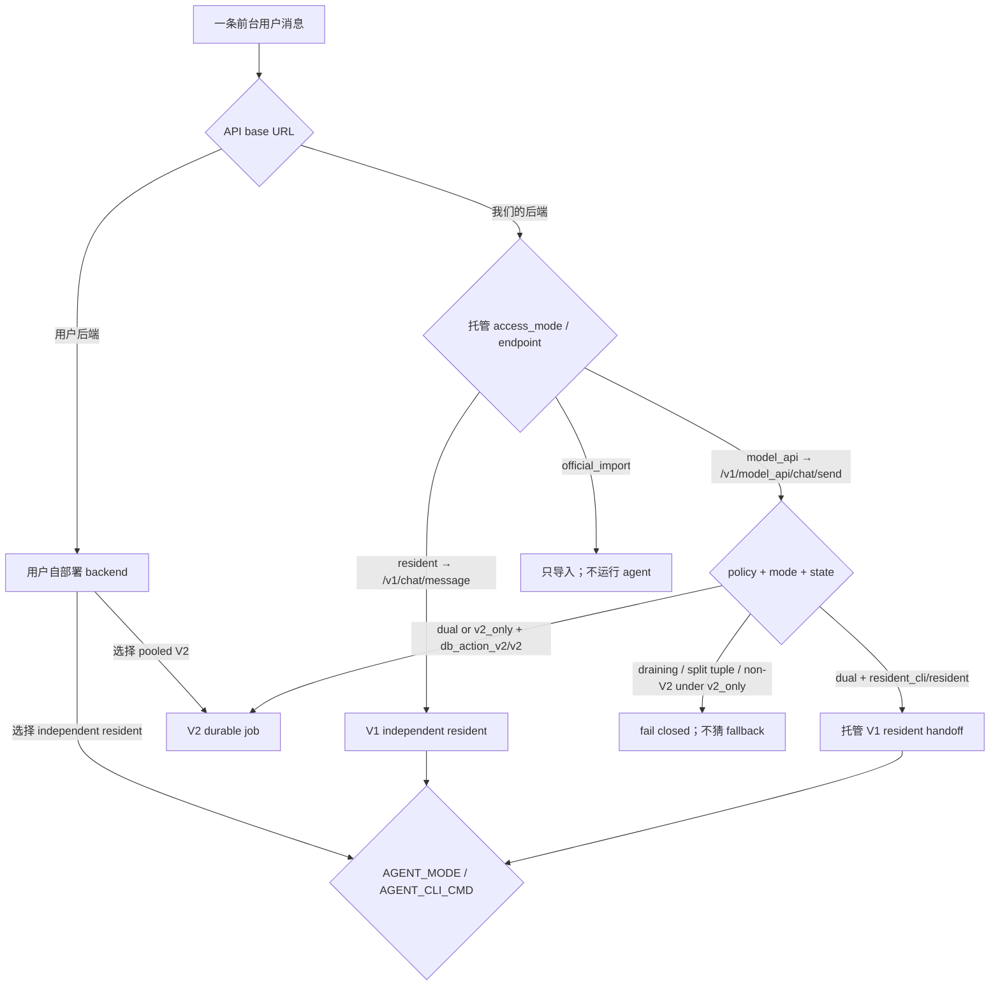

# 用户消息执行装配图

> 目标：给定一个用户的部署、`access_mode`、托管运行时 fence、消息类型与
> resident agent 配置，回答“这条消息经过哪些进程与模块”。
>
> 本图只描述当前装配，不据此删除代码。状态来自 2026-08-22 的执行环境审计；
> “不确定”表示缺少可观测的真实流量，不等于未部署或无人使用。

## 1. 先问这五个配置问题

1. iOS 的 API base URL 指向我们的托管后端，还是用户自己的后端？
2. 若指向托管后端，`access_mode` 是 `model_api`、`resident`，还是只用于导入的
   `official_import`？
3. 若是 `model_api`，进程环境的 `FEEDLING_HOSTED_RUNTIME_POLICY` 与该用户持久化的
   `(hosted_runtime_mode, runtime_state, generation)` 分别是什么？
4. 若由 resident consumer 执行，`AGENT_MODE` 是 `http` 还是 `cli`；CLI 的
   `AGENT_CLI_CMD` 实际驱动 Claude、Codex、Pi，还是操作员自定义程序？
5. 本次工作是前台用户消息，还是 `heartbeat` / `scheduled` / `manual_wake` /
   `screen_watch` / `capture` / `dream` / `maintenance` / `profile` 等后台 lane？

缺少其中任何一个答案，都不能从目录名、import 关系或 `v2` 字样推断实际路径。
接入路线的正式定义见 [ACCESS_ROUTES.md](ACCESS_ROUTES.md)。

## 2. 执行环境全集

“老旧”的严格判据是：现行 manifest 或配置已移除/禁用该环境，并有部署事实支持。
运维文档只能旁证；不能用“我们的数据库没有流量”反推。按这个判据，当前没有一条
环境可标为老旧。

| 路线 | Runtime / 子路径 | 当前状态 | 谁控制 agent / backend | 装配入口 |
| --- | --- | --- | --- | --- |
| ① 模型 API 托管 | V1 `resident_cli` | **不确定**：prod/test/pre 在 `dual` 下可路由，真实 fence 用户数未测 | 我们的独立 runner CVM / 我们的 backend | `hosted.chat_send_core._send_resident`；`agent_runtime/supervisor.py` |
| 待 Seven 定义 | PPS | **⛔ 未查证，保持空位** | 未知 | 未知；不得并入 model API、LiteLLM、BYOK 或 subscription 猜测 |
| ① 模型 API 托管 | V2 `db_action_v2` | **活**：T208/T016 有真实 job/trajectory 与 admin route 证据 | 我们的 `serve-worker` / 我们的 backend | `hosted.chat_send_core.model_api_chat_send_core`；`model_api_runtime/v2/serve_worker.py` |
| ② 自有服务器连接 | V1 resident consumer | **活**：T061 的 48h 窗口记录 86 calls / 16 users | 用户机器/VPS / 我们的 backend | `/v1/chat/message`、`/v1/chat/poll`、`/v1/chat/response`；`tools/chat_resident_consumer.py` |
| ③ 完全自部署 | V1 resident consumer | **不确定**：用户后端不可观测 | 用户 / 用户 | 与路线②相同的 V1 模块，base URL 与全部进程归用户控制 |
| ③ 完全自部署 | V2 worker pool | **不确定**：用户后端不可观测 | 用户 / 用户 | 与路线① V2 相同的 backend + worker 模块，部署与版本归用户控制 |

`official_import` 只导入聊天记录，不运行 agent，因此不进入 Runtime 图。

## 3. 进程图：import 闭包之外仍有运行入口



关键边界：

- `backend/hosted/chat_send_core.py::_send_resident` 不调用
  `agent_runtime/supervisor.py`。backend 进程只经
  `hosted.agent_runtime_cutover.check_supervisor_live` 读心跳/ownership，并把消息写入
  DB；独立 runner CVM 直接启动 supervisor，supervisor 再由
  `agent_runtime.spawners` 管每用户 consumer。
- `serve_worker.py` 是 V2 父进程入口，但模型 turn 不在父进程的 import 调用栈里运行。
  父进程的 `SlotFleet` spawn `turn_child.main`；slot 子进程才 claim job 并进入
  `worker._run_turn` / `worker.process_job`。
- `SlotFleet` 的每个 slot 由 `child_supervisor.ChildSupervisor` 管理。它不在消息数据链
  上，而是这条进程边界的故障隔离层：若把 turn、heartbeat 与 reaper 放回同一事件循环，
  一个同步阻塞就能同时冻住三者，DB 中旧 heartbeat 行仍存在但 `capacity` 不再更新；当前
  父进程用 progress pipe 识别卡死子进程，并可强杀、重启该 slot。
- enclave 通过 backend API 获得持久化数据；它不直接连 PostgreSQL。V2 slot 与
  resident consumer 则分别通过各自 adapter 直接访问所需的 DB/backend/enclave 边。
- Gunicorn 的 `asgi_app:app`、`enclave_app.py`、`serve_worker.py`、
  `supervisor.py` 都是部署/镜像入口。仅沿“谁 import 谁”搜索会漏掉这些独立进程与
  它们 spawn 的子进程。

## 4. 前台用户消息的配置到路径映射



### 4.1 托管入口与 ownership fence

`POST /v1/model_api/chat/send` 由
`hosted.chat_routes_asgi.model_api_chat_send` 接入，再在线程池调用
`hosted.chat_send_core.model_api_chat_send_core`：

| 控制值 | 实际结果 |
| --- | --- |
| policy=`dual`，mode=`resident_cli`，state=`resident` | 进入 `_send_resident`；校验 provider 和 supervisor 心跳，写加密用户消息，再由独立 V1 consumer claim |
| policy=`dual`，mode=`db_action_v2`，state=`v2` | 原子写 `chat_messages` + `agent_jobs(lane=chat)`，`core.wake_bus.notify("v2_jobs")` |
| policy=`v2_only`，精确 V2 tuple | 同上，进入 V2；API 返回的 `driver` 只是历史 wire label，不选择 Claude/Codex/Pi executor |
| state=`draining` | `runtime_switching` 503 |
| split/非法 tuple | `runtime_control_invalid` 503 |
| policy=`v2_only` 但不是精确 V2 tuple | `runtime_policy_not_ready` 503 |

V1 与 V2 没有请求期 fallback。V2 liveness/kill-switch 失败不会改走 resident；V1
supervisor 心跳失败也不会改走 V2。

### 4.2 路线② / 自部署 V1 的通用消息链

```text
chat.routes_asgi.chat_message
  → chat.chat_core.write_message
  → UserStore.append_chat + notify_chat_waiters
  → resident consumer GET /v1/chat/poll?claim=true
  → enclave decrypt/history view
  → tools.chat_resident_consumer._process_messages
  → call_agent → AGENT_MODE=http 或 call_agent_cli
  → action/tool execution + visible-reply sanitizers
  → post_reply → POST /v1/chat/response
  → chat.chat_core.write_response → encrypted assistant row + push/wake
```

claim 闸只允许精确 `resident_cli + resident` tuple。`db_action_v2` 用户即使误启动
外部 consumer，也不能 claim 同一条消息。generic `/v1/chat/message` 若属于 V2 用户，
`chat.chat_core._eager_enqueue_v2_chat` 会尽力补入 V2 chat job，周期 reconciler 是后备。

### 4.3 resident 不是一个 executor：先分 `AGENT_MODE`，再分 CLI driver

| 用户配置 | 实际模块/参数路径 | user MCP 的 chat/proactive 装配 |
| --- | --- | --- |
| `AGENT_MODE=http` | `call_agent_http`；agent HTTP 服务的内部模块由用户配置决定 | 不经过 CLI 的 `{mcp}`/argv 装配；不能套用四种 CLI 结论 |
| Claude 模板含 `{mcp}` | `_render_cli_template` → `_user_mcp_cli_value` 的 Claude 分支 | `--mcp-config=<USER_MCP_FILE>`；必要时附 `--allowed-tools=mcp__...__*` |
| Claude 老模板无 `{mcp}` | `_prepare_cli_command` → `_inject_claude_user_mcp` | 在 chat/proactive 补同一组 `--mcp-config` 与 grant；操作员已有 allowlist 时不替换 |
| Codex CLI | MCP server 已物化进 `config.toml`；`_user_mcp_cli_value` 返回逐 server override | chat/proactive 不禁用；其他 background lane 加 `-c mcp_servers.<name>.enabled=false` |
| Pi CLI | `_user_mcp_cli_value` 的 Pi 分支 | chat/proactive 加 `-e <PI_MCP_BRIDGE_FILE>`，bridge 把 MCP 注册为 Pi 原生工具；桥缺失则降级为无 MCP，不杀 turn |
| 其他自定义 CLI（Hermes/OpenClaw/任意命令） | `_prepare_cli_command` 与 driver detection 的实际结果 | 必须按模板逐项回答；不能从“resident”标签推断 Claude/Codex/Pi 的工具面 |

托管 V1 的 `agent_runtime.spawners.consumer_env` 只自动生成 Claude、Codex、Pi 三类
默认 `AGENT_CLI_CMD`；路线②/③的操作员可提供 HTTP 或任意 CLI，范围更宽。

## 5. Runtime V2：同一个 loop，两个前台/唤醒 call site

V2 父进程 `serve_worker.main` 负责 schema、assembly、scheduler、reaper、heartbeat 与
slot supervision。`build_production_deps` 将 provider、enclave、memory、World Book、
MCP、workspace、effect sink 等实现注入 dependency-clean 的 `worker.py`。slot 子进程的
`worker._run_turn` 解析 provider 后进入 `worker.process_job`。

| lane | `process_job` 分派 | 主要模块链 | 用户可见结果 |
| --- | --- | --- | --- |
| `chat` | 留在 `process_job` 前台分支 | context/tail/profile/memory/World Book → `tool_loop.run_tool_loop` → capability/MCP dispatch → effect outbox | 必须回复；加密 assistant row，可带文件/图片与 push |
| `heartbeat`, `scheduled`, `manual_wake`, `screen_watch` | `worker._run_wake` | wake context → 独立的 `tool_loop.run_tool_loop` call site → reply/stay-silent effect | weak wake 可静默；scheduled 有到点交付契约 |
| `capture`, `dream` | `worker._run_extraction` | capture/dream prompt + memory context → provider → parse → memory actions | 后台写记忆，不写聊天气泡 |
| `maintenance` | `worker._run_compaction` | deterministic context coverage | 后台维护，不写聊天气泡 |
| `profile` | `worker._run_profile` | Memory Garden/Profile source → provider → profile checkpoint | 后台生成 profile，不写聊天气泡 |
| `trajectory_review` | review handler | encrypted trajectory → optional provider review | 离线诊断，不是用户回复 |

`chat` 与 wake 虽调用同一 `tool_loop.run_tool_loop`，却是两个独立 call site，参数不能
互相推断。至少有以下有意差异：

- chat `memory_delete_allowed=True`、要求前台可见回复；wake 禁 delete，weak wake 可调用
  `stay_silent`。
- chat 的 World Book 扫描面是当前用户输入；wake 的扫描面来自触发信号，空扫描面只允许
  always-on 条目。
- 两侧各自组装 disabled tools、MCP surface、prompt frontier 与 delivery callback；修改
  一侧不代表另一侧已接线。

### 5.1 带屏幕帧时的两道独立安全闸

| 语义位 | 防什么 | 连接位置 | 结果 |
| --- | --- | --- | --- |
| `initial_screen_pixels_blocked` | **外泄面**：读到私密像素后不把内容发往 web/fetch/task 或受限可写 MCP | chat 与 wake 都可在有 frame message 时传入 | 不等于“平台写全禁” |
| `initial_untrusted_screen_only` | **注入面**：没有当前用户消息时，OCR/屏幕文字不能指挥 durable platform mutation | 只在 `_run_wake` 的 fresh-frame `screen_watch` call site 传入 | 禁平台 mutation tools；read/reply 与可见 delivery 保留 |

前台 `process_job` 故意不传 `initial_untrusted_screen_only`：同一轮有当前用户消息时，保留
正常工具面。不要把这两道闸合成一个 `screen blocked` 节点。

## 6. 进程入口审计：16 个 deploy 文本候选如何收敛

下面的 16 项来自对 `deploy/` 文本提取 `backend/*.py`。这个扫描能发现 import 闭包的
候选盲区，但命中不等于进程入口。

| 候选 | deploy 中的真实角色 | 应画在哪 |
| --- | --- | --- |
| `asgi_app.py`, `gunicorn_conf.py` | Gunicorn command 的 app/config | backend master/ASGI worker 进程 |
| `enclave_app.py` | compose command / image entrypoint | enclave 进程 |
| `agent_runtime/supervisor.py` | 独立 runner compose command / image entrypoint | V1 runner supervisor 进程 |
| `agent/perception_core.py` | plugin README 引用 | 被调用模块，不是 deploy 进程入口 |
| `content/routes_asgi.py`, `content_encryption.py`, `enclave/keys.py`, `perception/store.py` | 迁移/runbook 文本引用 | 所属 backend/enclave/consumer 进程内模块 |
| `db.py`, `object_storage.py` | env/setup/运维说明引用 | 共享基础设施 adapter，不是独立 Python 进程 |
| `hosted/config_store.py`, `hosted/runtime_reconciler.py` | compose env 注释引用 | backend lifespan/请求路径内模块 |
| `proactive/dashboard.py`, `push/apns.py` | compose env 注释引用 | backend 进程内模块 |

反向枚举实际 `command` / Docker `CMD` 还会找到扫描式正则漏掉的
`model_api_runtime/v2/serve_worker.py`。继续沿运行时 spawn 边才能找到
`turn_child.main` 与 `tools/chat_resident_consumer.py`。因此正确算法是：

1. 从 manifest 的 `command`、Docker `CMD`、systemd/进程管理配置枚举根进程；
2. 再追每个根进程的 runtime spawn、subprocess 与线程装配；
3. 最后才在每个进程内部追 import/DI 闭包；
4. 文档与注释命中只作线索，不直接升级成“在线进程”。

## 7. 用具体配置反查

### 例 A：托管 `model_api` + `dual` + `resident_cli/resident` + OpenAI provider

`/v1/model_api/chat/send` → backend `_send_resident` → supervisor heartbeat gate → DB
chat row → 独立 runner supervisor → per-user consumer → Codex CLI → `/v1/chat/response`。
这里 provider-derived `driver=codex` 真正选择 V1 CLI；不要套用 V2 的“wire label only”。

### 例 B：托管 `model_api` + `db_action_v2/v2` + 前台图文消息

`/v1/model_api/chat/send` → backend 原子 append/enqueue → `v2_jobs` notify →
serve-worker parent 的 foreground slot → turn child → `process_job(chat)` →
prompt/context/World Book + 屏幕像素外泄闸 → provider-native `tool_loop` → capability/MCP
dispatch → generation-fenced effect outbox → encrypted reply/push。返回体里的
`driver=claude|codex|pi` 只是兼容标签，不改变这条 loop。

### 例 C：路线② `resident` + `AGENT_MODE=cli` + 旧 Claude 模板

`/v1/chat/message` → 我们的 backend → 用户 VPS consumer claim/decrypt →
`_process_messages` → `_prepare_cli_command` → 因模板无 `{mcp}` 进入
`_inject_claude_user_mcp` → Claude subprocess → visible-reply/action pipeline →
`/v1/chat/response`。如果只画“resident consumer”，就看不见这条老模板注入边。

### 例 D：`screen_watch` 有 fresh frame，但没有当前用户消息

scheduler → `agent_jobs(screen_watch)` → wake slot child → `_run_wake` →
screen frame context → `run_tool_loop(initial_screen_pixels_blocked=True,
initial_untrusted_screen_only=True)`。外泄工具与 durable platform mutation 分别由两道闸
约束；模型仍可读取允许的上下文、选择沉默或发送可见回复。

### 例 E：完全自部署 V2

模块链可与例 B 同形，但 backend、enclave、PostgreSQL、object store、serve-worker 与
版本全部由用户控制。我们的 heartbeat/DB/trace 为零不能证明该环境无人使用或已老旧。

## 8. 已知空位与后续审计

- **PPS**：仓库、部署与舰队资料没有权威全称/坐标。在 Seven 给定义前保持空白；图里
  画出一条猜测路径会被读者当成已存在的装配事实。
- **T216 世界书、T217 Dream**：本图给出它们所在的 V1/V2 process/lane 坐标，但不把
  “代码存在/已接线”冒充端到端观测覆盖。两项应分别从触发、读取/匹配、provider
  disclosure、应用/交付与 trace 记录点做独立闭环。
- **自部署**：只能描述仓库支持的装配，不能声明用户正在运行的 commit、拓扑或流量。
